# GAS PASS ⛽

**Gas Abstraction for Web2 to Web3 User Onboarding**

GAS PASS eliminates the biggest barrier between Web2 and Web3: gas fee complexity. We provide Web3 platforms with an abstraction layer to seamlessly onboard their Web2 users without forcing them to understand or manage blockchain transaction fees.

> **Created**: June 2025  
> **Version**: 1.0.0  
> **Status**: Active Development  
> **Mission**: Bridge the gap between Web2 user expectations and Web3 functionality

---

## 💡 **The Core Problem**

### **The Web2 to Web3 Onboarding Crisis**

**95% of Web2 users abandon Web3 platforms** during the onboarding process due to:

❌ **Gas Fee Confusion**: "What is gas? Why do I need SOL just to use your app?"  
❌ **Wallet Complexity**: Installing MetaMask, managing seed phrases, understanding private keys  
❌ **Transaction Failures**: "Why did my transaction fail? Where did my money go?"  
❌ **Unpredictable Costs**: Gas fees fluctuating from $0.01 to $10+ mid-transaction  
❌ **Mental Overhead**: Having to think about blockchain mechanics instead of using the product  

### **The Result: Massive User Drop-off**
- 🔻 **99% drop-off** from Web2 app visit to first successful Web3 transaction
- 📉 **$50-200 CAC** wasted on users who never complete onboarding
- 😤 **Frustrated users** who view Web3 as "too complicated"
- 💔 **Lost revenue** from users who would love your product but can't access it

---

## 🎯 **GAS PASS Solution: Invisible Web3**

### **Make Web3 Feel Like Web2**

GAS PASS provides Web3 platforms with a **gas abstraction layer** that lets Web2 users interact with blockchain applications **without ever knowing they're using blockchain**.

```mermaid
graph LR
    A[Web2 User] --> B[Your Platform]
    B --> C[GAS PASS Layer]
    C --> D[Solana Blockchain]
    
    A -.-> E["✅ Familiar UX<br/>✅ No wallet setup<br/>✅ No gas fees<br/>✅ Instant actions"]
    D -.-> F["🔧 Blockchain benefits<br/>🔧 Decentralization<br/>🔧 Ownership<br/>🔧 Composability"]
```



### **How It Works for Platforms**

1. **🎭 Platform Sponsors Gas**: You cover transaction costs for your users
2. **🎨 Seamless UX**: Users interact with familiar UI/UX patterns
3. **⚡ Instant Actions**: No wallet popups, no gas confirmations, no waiting
4. **💰 Predictable Costs**: You pay fixed, bulk rates for gas services
5. **📈 Higher Conversion**: 10x improvement in user onboarding success

---

## 🎪 **Target Platforms & Use Cases**

### **🎮 Gaming Platforms → Web3 Gaming**
**Challenge**: Gamers expect instant, free actions. Gas fees kill game flow.

**GAS PASS Solution**:
- Players move characters, attack, collect rewards **instantly**
- No "approve transaction" popups during gameplay
- Platform pays gas in bulk, passes minimal cost to users via game economy
- **Result**: 90%+ of Web2 gamers successfully complete first Web3 game session

**Target Platforms**: Traditional gaming companies adding Web3 features, new Web3 games

### **🛍️ E-commerce → NFT Marketplaces**
**Challenge**: Shoppers expect Amazon-like checkout. Wallet setup kills conversions.

**GAS PASS Solution**:
- Users buy NFTs with credit cards, no wallet required
- Platform handles all blockchain interactions behind the scenes
- Gasless minting, trading, and transfers
- **Result**: Web2 e-commerce conversion rates in NFT marketplaces

**Target Platforms**: E-commerce giants, fashion brands, collectible companies

### **🎵 Creator Platforms → Tokenized Communities**
**Challenge**: Creators want to monetize via tokens, but fans won't use crypto wallets.

**GAS PASS Solution**:
- Fans tip creators, buy exclusive content with familiar payment methods
- Automatic token distribution without user gas management
- Seamless community token interactions
- **Result**: 100x increase in fan participation in tokenized creator economies

**Target Platforms**: YouTube, TikTok, Patreon, OnlyFans looking to integrate Web3

### **💰 Fintech → DeFi Integration**
**Challenge**: Traditional finance users want DeFi yields but not DeFi complexity.

**GAS PASS Solution**:
- Users earn DeFi yields through familiar banking interfaces
- Platform abstracts all DeFi interactions, manages gas costs
- Seamless staking, lending, yield farming behind traditional UI
- **Result**: Mainstream adoption of DeFi services

**Target Platforms**: Banks, investment apps, savings platforms

### **📱 Social Media → Decentralized Social**
**Challenge**: Social media users expect free, instant interactions.

**GAS PASS Solution**:
- Post, like, share, tip without any blockchain friction
- Platform sponsors gas for social interactions
- Gradual Web3 feature introduction without disrupting UX
- **Result**: Web2 social media engagement rates in Web3 platforms

**Target Platforms**: Twitter, Instagram, Reddit exploring decentralization

---

## 🏗️ **Platform Integration Architecture**

### **Three Integration Levels**

#### **🟢 Level 1: Invisible Web3 (Recommended for Web2 Migration)**
```javascript
// Platform manages user accounts and gas fees behind the scenes
import { GasPassClient } from '@gaspass/sdk';

const gasPassClient = new GasPassClient(connection, {
  cluster: 'mainnet-beta',
  apiKey: 'your-platform-api-key'
});

// Create user account (platform managed)
await gasPassClient.createUserAccount(platformManagedKeypair.publicKey);

// Execute transaction invisibly - user just sees success message
const result = await gasPassClient.executeGaslessTransaction(
  transaction,
  platformManagedKeypair,
  {
    autoTopUp: true,
    topUpAmount: 0.1,
    priority: 'medium'
  }
);

// User sees: "Action completed!" 
// Platform handles: All blockchain complexity
```

#### **🟡 Level 2: Guided Web3 (For Web3-curious users)**
```javascript
// Show blockchain progress but handle complexity
const gasEstimate = await gasPassClient.estimateGasFee(transaction, 'medium');
console.log('Blockchain fee covered by platform:', gasEstimate.estimatedCost);

const result = await gasPassClient.executeGaslessTransaction(
  transaction,
  userKeypair,
  {
    autoTopUp: true,
    priority: 'medium'
  }
);

// Show user: "Your action is being secured on Solana blockchain..."
await gasPassClient.waitForConfirmation(result.signature);
```

#### **🔴 Level 3: Full Web3 (For crypto-native users)**
```javascript
// Traditional gasless transactions for users who want control
const relayResult = await gasPassClient.relayTransaction({
  transaction,
  userPublicKey: userKeypair.publicKey,
  priority: 'high',
  maxFee: 10000
});

const status = await gasPassClient.getTransactionStatus(relayResult.signature);
```

### **Platform Benefits**

#### **📊 Conversion Rate Optimization**
- **Before GAS PASS**: 1% of Web2 visitors complete first Web3 action
- **After GAS PASS**: 10-50% completion rate depending on implementation
- **ROI**: 10-50x improvement in user acquisition efficiency

#### **💰 Cost Structure**
```
Traditional Web3 Onboarding:
- $50-200 CAC per completed user
- 99% waste on users who drop off
- Unpredictable gas costs

GAS PASS Onboarding:
- $2-10 gas cost per user (platform pays)
- 90%+ completion rate
- Predictable, bulk pricing
- 5-25x lower effective CAC
```

#### **⚡ User Experience**
| Traditional Web3 | GAS PASS Web3 |
|------------------|---------------|
| 15+ step onboarding | 1-click action |
| Wallet downloads | No downloads |
| Seed phrase backup | Email signup |
| Gas fee education | Invisible fees |
| Transaction failures | 99.9% success |
| 10+ minute setup | Instant start |

---

## 🚀 **Platform Integration Guide**

### **For Web2 Platforms Adding Web3 Features**

#### **🎯 Step 1: Identify Your Use Cases**
```
Common Web2 → Web3 Transitions:
✅ Digital collectibles → NFTs
✅ In-app purchases → Token transactions  
✅ User rewards → Token rewards
✅ Premium content → Gated NFT content
✅ User profiles → Web3 identity
✅ Social features → Decentralized social
```

#### **⚙️ Step 2: Choose Integration Level**
```javascript
// Initialize GasPass client for platform use
import { GasPassClient } from '@gaspass/sdk';

const gasPassClient = new GasPassClient(connection, {
  cluster: 'mainnet-beta',
  apiKey: process.env.GASPASS_PLATFORM_API_KEY,
  timeout: 30000
});

// Your existing user flow with gasless backend:
app.post('/buy-premium', async (req, res) => {
  try {
    // Create platform-managed transaction
    const transaction = new Transaction().add(
      // Your NFT minting instruction here
    );
    
    // Execute gasless for user
    const result = await gasPassClient.executeGaslessTransaction(
      transaction,
      platformKeypair,
      {
        autoTopUp: true,
        topUpAmount: 0.1,
        priority: 'medium'
      }
    );
    
    res.json({ 
      success: true, 
      message: 'Premium activated!',
      transactionId: result.signature 
    });
  } catch (error) {
    res.status(500).json({ error: 'Transaction failed' });
  }
});
```

#### **📈 Step 3: Gradual Web3 Feature Rollout**
```
Week 1-2: Invisible Web3
- Add blockchain features behind existing UI
- Monitor user engagement, no UX changes

Week 3-4: Gentle Education  
- "Your rewards are now secured on blockchain!"
- Still no complexity, just education

Week 5+: Optional Web3 Features
- "Export your NFTs to external wallet"
- "View on blockchain explorer"
- Advanced users can go full Web3
```

### **For New Web3 Platforms**

#### **🎯 Build Web2-First, Web3-Powered**
```javascript
// Initialize GasPass for new platform
import { GasPassClient } from '@gaspass/sdk';

const gasPassClient = new GasPassClient(connection, {
  cluster: 'mainnet-beta',
  apiKey: 'your-api-key',
  timeout: 15000
});

// Create seamless user onboarding
async function onboardUser(userEmail) {
  // Create user account (platform manages keys)
  const userAccount = await gasPassClient.createUserAccount(platformUserKeypair.publicKey);
  
  // Pre-fund account for seamless experience
  const topUpRequest = {
    userPublicKey: platformUserKeypair.publicKey,
    tokenMint: new PublicKey('EPjFWdd5AufqSSqeM2qN1xzybapC8G4wEGGkZwyTDt1v'), // USDC
    amount: 10
  };
  
  await gasPassClient.topUpAccount(topUpRequest);
  
  return { userAccount, ready: true };
}
```

---

## 🪙 **$GASPASS Token: Community-Owned Infrastructure**

### **Why a Token? Decentralizing Gas Abstraction**

GAS PASS is **community-owned infrastructure** powered by the $GASPASS token. As an open-source, decentralized protocol, the token ensures the network remains community-controlled while creating sustainable incentives for all participants.

#### **🏛️ Network Governance**
```
Token holders collectively decide:
✅ Protocol upgrades and improvements
✅ Relayer qualification standards  
✅ Fee structures and adjustments
✅ Treasury fund allocation
✅ Network expansion to new chains
```

*No central authority controls the protocol—token holders are the protocol.*

#### **🔒 Economic Security Through Staking**
```
Relayers must stake $GASPASS tokens to:
✅ Join the network (proving commitment)
✅ Process transactions (earning rewards)
✅ Secure the network (preventing attacks)
✅ Earn priority routing (better rewards)
```

*Staked tokens can be slashed for poor performance or malicious behavior.*

#### **💰 Fee Discounts & Revenue Sharing**
```
Platforms holding $GASPASS tokens get:
✅ 20% discount on transaction fees
✅ Priority transaction processing
✅ Access to premium relayer nodes
✅ Higher rate limits

Relayers earn from:
✅ Transaction processing fees (60%)
✅ Token staking rewards (25% of fees)
✅ Network growth incentives
```

### **📊 Fair Distribution Model**

```
Total Supply: 1,000,000,000 $GASPASS

🌍 40% Community Rewards (400M)
├── 20% Relayer operation incentives
├── 10% Platform integration rewards
├── 5% Open-source developer grants
└── 5% User adoption programs

🏛️ 25% Protocol Treasury (250M) 
├── 15% Network development & audits
├── 5% Cross-chain expansion
└── 5% Ecosystem growth

👥 20% Team & Contributors (200M)
└── 4-year vesting, performance-based

💧 10% Initial Liquidity (100M)
└── DEX trading and accessibility

🤝 5% Advisors & Partnerships (50M)
└── 2-year vesting schedule
```

### **🔄 Sustainable Economics**

#### **Token Utility Creates Real Demand**
- **Platforms**: Need tokens for fee discounts as they scale
- **Relayers**: Stake tokens to earn from growing transaction volume  
- **Developers**: Earn tokens for contributing to open-source protocol
- **Community**: Govern the future of Web3 gas abstraction

#### **Deflationary Mechanisms**
```
Fee Burns: 50% of protocol fees burned quarterly
Staking Requirements: Tokens locked for network security
Network Growth: Higher usage = higher token demand
```

### **🚀 Community-First Launch**

#### **Phase 1: Fair Launch (No Pre-Sale)**
```
✅ No ICO or private investor rounds
✅ Tokens earned through network contribution
✅ Relayer operators mine tokens by serving users
✅ Developers earn through open-source contributions
✅ Platforms rewarded for successful integrations
```

#### **Phase 2: Utility Activation**  
```
✅ Governance voting activates
✅ Staking requirements for relayers
✅ Fee discount system goes live
✅ Revenue sharing begins
```

#### **Phase 3: Ecosystem Expansion**
```
✅ Multi-chain support using token bridges
✅ DAO treasury funds development
✅ Advanced features for token holders
✅ Cross-protocol partnerships
```

### **💡 Value Proposition by Role**

#### **🔧 For Relayers**
*"Stake $GASPASS to earn from the growing gasless economy. Your infrastructure investment grows with network adoption."*

#### **🏢 For Platforms** 
*"Hold $GASPASS to reduce gas costs by 20%. As your users grow, token appreciation rewards your early adoption."*

#### **👨‍💻 For Developers**
*"Build the future of Web3 UX and earn tokens for contributions. Own infrastructure you help create."*

#### **🌍 For Community**
*"Token holders own the infrastructure making Web3 accessible to billions. No VCs, no central control—just community ownership."*


---

## 🛠️ **Technical Implementation**

### **Quick Start for Platforms**

```bash
npm install @gaspass/sdk
```

```javascript
import { GasPassClient } from '@gaspass/sdk';
import { Connection, Keypair, SystemProgram, Transaction } from '@solana/web3.js';

// Initialize GasPass client for your platform
const connection = new Connection('https://api.mainnet-beta.solana.com');
const gasPassClient = new GasPassClient(connection, {
  cluster: 'mainnet-beta',
  apiKey: process.env.GASPASS_API_KEY,
  relayerUrl: 'https://relayer.gaspass.cc', // Optional, uses defaults
  timeout: 30000
});

// Platform manages user accounts and sponsors gas
const platformKeypair = Keypair.fromSecretKey(/* your platform key */);

// Create user account (one-time setup)
await gasPassClient.createUserAccount(platformKeypair.publicKey);

// Top up platform account to sponsor user transactions
const topUpRequest = {
  userPublicKey: platformKeypair.publicKey,
  tokenMint: new PublicKey('EPjFWdd5AufqSSqeM2qN1xzybapC8G4wEGGkZwyTDt1v'), // USDC
  amount: 1000 // Bulk funding for many user transactions
};
await gasPassClient.topUpAccount(topUpRequest);

// Execute gasless transactions for users
async function executeUserAction(userAction) {
  const transaction = new Transaction().add(
    SystemProgram.transfer({
      fromPubkey: platformKeypair.publicKey,
      toPubkey: userAction.recipient,
      lamports: userAction.amount
    })
  );

  // Platform pays gas, user gets seamless experience
  const result = await gasPassClient.executeGaslessTransaction(
    transaction,
    platformKeypair,
    {
      autoTopUp: true,
      priority: 'medium'
    }
  );

  return result.signature;
}
```

### **Advanced Features**

#### **🎨 Platform Account Management**
```javascript
// Get platform account status
const platformAccount = await gasPassClient.getUserAccount(platformKeypair.publicKey);
console.log('Platform balance:', platformAccount.balance);
console.log('Available credits:', platformAccount.credits);

// Monitor supported tokens for fee payments
const supportedTokens = await gasPassClient.getSupportedTokens();
console.log('Available fee tokens:', supportedTokens);

// Bulk withdraw when needed
const withdrawRequest = {
  userPublicKey: platformKeypair.publicKey,
  amount: 50000000, // 0.05 SOL
  destination: platformKeypair.publicKey
};
await gasPassClient.withdrawCredits(withdrawRequest);
```

#### **💳 Cost Management & Analytics**
```javascript
// Estimate costs before execution
const gasEstimate = await gasPassClient.estimateGasFee(
  transaction, 
  'medium',
  new PublicKey('EPjFWdd5AufqSSqeM2qN1xzybapC8G4wEGGkZwyTDt1v') // USDC
);

console.log('Estimated cost in lamports:', gasEstimate.estimatedCost);
console.log('Cost in USDC:', gasEstimate.feeInToken);

// Track transaction status for monitoring
const status = await gasPassClient.getTransactionStatus(result.signature);
console.log('Transaction status:', status.status);
console.log('Confirmations:', status.confirmations);

// Get relayer network information
const relayers = await gasPassClient.getRelayers();
console.log('Available relayers:', relayers.length);
```

#### **📊 Batch Operations for High Volume**
```javascript
// Execute multiple user actions efficiently
const userTransactions = [
  { user: 'user1', action: 'mint_nft' },
  { user: 'user2', action: 'transfer_token' },
  { user: 'user3', action: 'stake_rewards' }
];

const results = await Promise.allSettled(
  userTransactions.map(async (userTx) => {
    const transaction = createTransactionForUser(userTx);
    return gasPassClient.executeGaslessTransaction(
      transaction,
      platformKeypair,
      { priority: 'low' } // Lower priority for bulk operations
    );
  })
);

// Wait for all confirmations
const confirmations = await Promise.allSettled(
  results
    .filter(r => r.status === 'fulfilled')
    .map(r => gasPassClient.waitForConfirmation(r.value.signature))
);
```

---

## 🚀 **Getting Started**

### **For Platforms Ready to Onboard Web2 Users**

#### **🎯 Phase 1: Assessment (Week 1)**
1. **Audit Current Onboarding**: Where do Web2 users drop off?
2. **Identify Web3 Opportunities**: What blockchain features add value?
3. **Calculate ROI**: Use our ROI calculator for your specific case

#### **⚙️ Phase 2: Integration (Week 2-3)**
1. **Install SDK**: `npm install @gaspass/sdk`
2. **Implement Invisible Mode**: Hide all Web3 complexity
3. **Test with Beta Users**: Validate improved conversion rates

#### **📈 Phase 3: Scale (Week 4+)**
1. **Monitor Metrics**: Track conversion rate improvements
2. **Optimize Costs**: Bulk gas pricing for high-volume platforms
3. **Add Features**: Gradually introduce Web3 benefits

### **Contact Our Platform Team**

- **📧 Platform Partnerships**: platforms@gaspass.cc
- **💬 Technical Integration**: [Discord Developer Channel](https://discord.gg/gaspass)

---

## 🗺️ **Roadmap: Enabling Web2 to Web3 Migration**

### **Q3 2025: Foundation**
- ✅ Platform SDK Beta Launch
- ✅ Invisible Web3 Mode
- 🔄 First 10 Platform Integrations

### **Q4 2025: Scale**
- 🎯 Fiat-to-Crypto Integration
- 🎯 100+ Platform Integrations
- 🎯 White-Label Wallet Infrastructure
- 🎯 Advanced Analytics Dashboard
- 🎯 Mobile Platform SDK

### **Q1 2026: Ecosystem**
- 🎯 Cross-Platform Asset Portability
- 🎯 Platform Marketplace
- 🎯 AI-Powered User Onboarding
- 🎯 Multi-Chain Support

### **Q2 2026: Global Adoption**
- 🎯 Regulatory Compliance Suite
- 🎯 10M+ Web2 Users Onboarded

---

## 📄 **Resources for Platforms**

### **📚 Integration Guides**
- [Platform Integration Playbook](https://docs.gaspass.cc/platform-guide)
- [Web2 to Web3 Migration Strategies](https://docs.gaspass.cc/migration)
- [Legal & Compliance Guidelines](https://docs.gaspass.cc/compliance)

### **🛠️ Developer Resources**
- [Platform SDK Documentation](https://docs.gaspass.cc/platform-sdk)
- [SDK Repository](https://github.com/gas-pass/gas-pass-sdk)
- [API Reference](https://api.gaspass.cc/platform)
- [Integration Examples](https://github.com/gas-pass/gas-pass-sdk)

---

**Built for platforms that want to bridge Web2 and Web3 without sacrificing user experience.**

*Making Web3 adoption inevitable by making it invisible.*