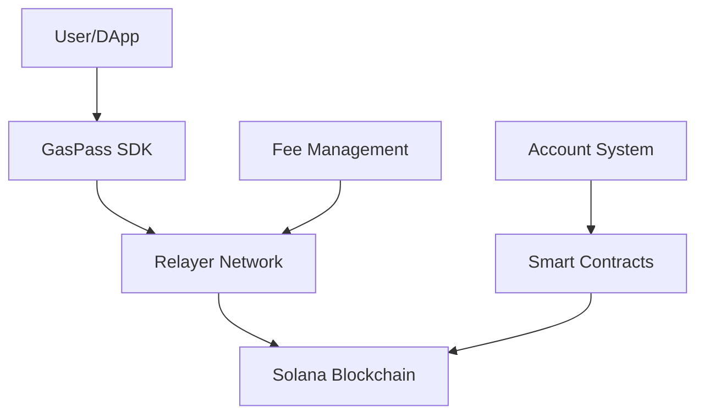

# GAS PASS ⛽

**Advanced Solana Gas Solution - Enabling True Web3 Adoption**

GAS PASS is a cutting-edge gasless transaction platform for the Solana blockchain, built with Rust for maximum performance and security. We're eliminating the biggest barrier to Web3 adoption: the complexity and cost of gas fees and user transaction approval.

> **Created**: June 2025  
> **Version**: 1.0.0  
> **Status**: Active Development  
> **Network**: Solana Mainnet, Devnet, Testnet

---

## 🎯 **The Problem We Solve**

Traditional blockchain interactions require users to:
- ❌ Understand gas fees and their fluctuations
- ❌ Hold native tokens (SOL) just to interact with dApps
- ❌ Worry about failed transactions due to insufficient gas
- ❌ Navigate complex wallet setups before using any application

**GAS PASS eliminates all of these friction points, enabling seamless Web3 experiences.**

---

## 🌟 **Core Value Propositions**

### **For End Users**
- **Zero Gas Hassle**: Interact with Solana dApps without owning SOL
- **Pay with Any Token**: Use USDC, USDT, or any supported token for fees
- **Simplified Onboarding**: Start using Web3 apps immediately
- **Predictable Costs**: Know exactly what you'll pay upfront

### **For Developers & DApps**
- **Increased User Adoption**: Remove the #1 barrier to user onboarding
- **Better UX**: Users focus on your app, not gas management
- **Flexible Integration**: Drop-in SDK with minimal code changes
- **Enterprise Ready**: Scalable infrastructure for high-volume applications

### **For Relayers & Infrastructure**
- **Earn Revenue**: Get paid for processing gasless transactions
- **Flexible Operations**: Choose which tokens to accept and fee rates
- **Decentralized Network**: Join a distributed relayer ecosystem
- **Risk Management**: Built-in protections and collateral systems

---

## 🚀 **Key Features**

### **🔥 Gasless Transactions**
Execute any Solana transaction without users holding SOL. Perfect for:
- Token transfers and swaps
- NFT minting and trading  
- DeFi interactions (lending, borrowing, staking)
- Gaming actions and rewards
- Social media interactions

### **💰 Multi-Token Fee Support**
Pay transaction fees with:
- **Native Ecosystem Token**: $GASPASS is the ecosystem token
- **Stablecoins**: USDC, USDT for predictable costs
- **Native SOL**: Traditional gas payment method
- **Custom Tokens**: Project-specific tokens and loyalty points
- **Fiat Integration**: Credit card payments (coming soon)

### **🔗 Seamless Integration**
- **5-minute setup** for existing Solana dApps
- **TypeScript SDK** with complete type safety
- **React hooks** for frontend integration
- **REST API** for backend services
- **WebSocket** for real-time transaction updates

### **⚡ Enterprise-Grade Infrastructure**
- **High Throughput**: Handle thousands of transactions per second
- **99.9% Uptime**: Redundant relayer network
- **Global Coverage**: Relayers in multiple regions
- **MEV Protection**: Advanced transaction ordering algorithms

---

## 🎪 **Target Markets & Use Cases**

### **🎮 Gaming & Metaverse**
**Market Size**: $180B+ gaming market moving to Web3

**Use Cases**:
- **In-game actions**: Move characters, attack, collect rewards without gas fees
- **NFT rewards**: Instant reward distribution without user gas management
- **Tournaments**: Mass tournament payouts to thousands of players
- **Cross-game assets**: Seamless asset transfers between games

**Target Users**: Game developers, players, gaming platforms

### **🛍️ E-commerce & Marketplaces**
**Market Size**: $26B+ NFT marketplace volume

**Use Cases**:
- **NFT purchases**: Buy NFTs with credit cards (gas handled automatically)
- **Loyalty programs**: Redeem points for blockchain rewards
- **Supply chain**: Track products without end-user gas complexity
- **Digital collectibles**: Seamless collecting experiences

**Target Users**: E-commerce platforms, retailers, collectors

### **🏦 DeFi & Financial Services**
**Market Size**: $100B+ DeFi total value locked

**Use Cases**:
- **Micro-transactions**: Enable sub-dollar DeFi interactions
- **Savings protocols**: Automated savings without gas friction
- **Payment processors**: Accept crypto payments without gas barriers
- **Cross-border payments**: Instant, low-cost international transfers

**Target Users**: Fintech companies, payment processors, DeFi protocols

### **🌐 Social & Creator Economy**
**Market Size**: $104B+ creator economy

**Use Cases**:
- **Content monetization**: Tip creators without gas fees
- **Social tokens**: Create and distribute community tokens
- **Creator NFTs**: Mint and sell content as NFTs seamlessly
- **Fan engagement**: Gasless voting and community participation

**Target Users**: Social platforms, content creators, influencers

### **🏢 Enterprise & B2B**
**Market Size**: Enterprise blockchain adoption growing 67% annually

**Use Cases**:
- **Customer onboarding**: Remove Web3 complexity for enterprise customers
- **Bulk operations**: Process thousands of transactions efficiently
- **White-label solutions**: Integrate blockchain features transparently
- **API monetization**: Charge for services in crypto without gas complexity

**Target Users**: Enterprises, SaaS companies, API providers

---

## 🏗️ **Technical Architecture**

### **Core Components**



- **🔐 Smart Contracts**: Rust-based Solana programs for secure gas management
- **🌐 Relayer Network**: Distributed system for transaction execution
- **📚 Client SDK**: JavaScript/TypeScript library for seamless integration
- **⚖️ Fee Management**: Automated calculation, collection, and distribution
- **💾 Account System**: User balance management and credit tracking

### **Security Features**

- **🛡️ Battle-tested Contracts**: Audited by leading security firms
- **🔒 Multi-sig Governance**: Decentralized protocol management
- **⏰ Time-locked Upgrades**: Safe protocol evolution
- **💰 Insurance Fund**: Protection against relayer failures
- **🚨 Real-time Monitoring**: 24/7 system health tracking

---

## 🚀 **Getting Started**

### **For DApp Developers**

```bash
# Install the SDK
npm install @gaspass/sdk

# Basic integration
import { GasPassClient } from '@gaspass/sdk';

const gasPass = new GasPassClient(connection, {
  cluster: 'mainnet-beta',
  apiKey: 'your-api-key'
});

// Execute gasless transaction
const result = await gasPass.executeGaslessTransaction(
  transaction,
  userKeypair,
  { autoTopUp: true }
);
```

### **For Relayers**

```bash
# Clone the relayer
git clone https://github.com/GasPassInc/gas-pass-open-relayer
cd gas-pass-open-relayer

# Setup configuration
cp .env.example .env
# Edit .env with your settings

# Start relayer
npm run start:relayer
```

### **Development Setup**

1. **Prerequisites**
   ```bash
   # Required tools
   node >= 16.0.0
   rust >= 1.70.0
   solana-cli >= 1.16.0
   ```

2. **Quick Start**
   ```bash
   git clone https://github.com/GasPassInc/gas-pass-open-relayer
   cd gas-pass-open-relayer
   npm install
   
   # Start local development
   npm run dev
   ```

3. **Configuration**
   ```env
   # Network Configuration
   CLUSTER_URL=devnet
   PROGRAM_ID=GasP4ssDevnetProgramId11111111111111111111
   
   # Relayer Configuration  
   RELAYER_FEE=0.001
   MIN_TOPUP_AMOUNT=0.1
   MAX_GAS_PRICE=0.01
   
   # API Configuration
   API_KEY=your-api-key
   WEBHOOK_URL=https://your-app.com/webhooks
   ```

---

## 🤝 **Community & Ecosystem**

### **Join Our Community**
- **📢 Discord**: [Join Developer Discussions](https://discord.gg/gaspass)
- **🐦 Twitter**: [@GasPassSolana](https://x.com/GasPass_)
- **📚 Documentation**: [docs.gaspass.cc](https://docs.gaspass.cc)
- **📧 Developer Support**: developers@gaspass.cc

### **Bug Bounty Program**
We take security seriously. Report vulnerabilities and earn rewards:
- **💰 Critical**: Up to $50,000
- **⚠️ High**: Up to $10,000  
- **📝 Medium**: Up to $2,500
- **📧 Contact**: security@gaspass.cc

---

## 🗺️ **Roadmap**

### **Q3 2025**
- ✅ Mainnet Beta Launch
- ✅ Core SDK Release
- ✅ First 100 DApp Integrations
- 🔄 Enterprise API Launch

### **Q4 2025**
- 🎯 Mobile SDK Release
- 🎯 Fiat Payment Integration
- 🎯 Cross-chain Bridge Support
- 🎯 Advanced Analytics Dashboard

### **Q1 2026**
- 🎯 Layer 2 Integration
- 🎯 Governance Token Launch
- 🎯 Decentralized Relayer DAO
- 🎯 Multi-chain Expansion

---

## 🤝 **Contributing**

We welcome contributions from the community! Whether you're a developer, designer, or blockchain enthusiast, there are many ways to get involved.

### **Ways to Contribute**
- 🐛 **Bug Reports**: Help us identify and fix issues
- 💡 **Feature Requests**: Suggest new capabilities
- 🔧 **Code Contributions**: Submit pull requests
- 📚 **Documentation**: Improve guides and tutorials
- 🌍 **Translation**: Help localize for global users

### **Development Process**
1. Fork the repository
2. Create a feature branch (`git checkout -b feature/amazing-feature`)
3. Commit your changes (`git commit -m 'Add amazing feature'`)
4. Push to the branch (`git push origin feature/amazing-feature`)
5. Open a Pull Request

---

## 📄 **Legal & Compliance**

- **📋 License**: MIT License - see [LICENSE](LICENSE) file
- **🔒 Privacy Policy**: [privacy.gaspass.cc](https://privacy.gaspass.cc)
- **📜 Terms of Service**: [terms.gaspass.cc](https://terms.gaspass.cc)
- **🏛️ Compliance**: SOC 2 Type II, GDPR compliant

---

## 🏆 **Recognition & Awards**

- 🥇 **Solana Summer Camp 2025**: Winner - Best Infrastructure Project
- 🏆 **Web3 Innovation Awards**: Finalist - Best Developer Tools
- 📈 **Techstars Solana**: Portfolio Company
- 🌟 **Product Hunt**: #1 Product of the Day

---

**Built with ❤️ by the GAS PASS Team**

*Making Web3 accessible to everyone, one gasless transaction at a time.*

---

<div align="center">

[](https://www.npmjs.com/package/@gaspass/sdk)
[](https://discord.gg/gaspass)
[](https://x.com/GasPass_)
[](https://github.com/GasPassInc/gas-pass-open-relayer)

[**Get Started**](https://docs.gaspass.cc) • [**API Docs**](https://api.gaspass.cc) • [**Community**](https://discord.gg/gaspass) • [**Enterprise**](mailto:enterprise@gaspass.cc)

</div>